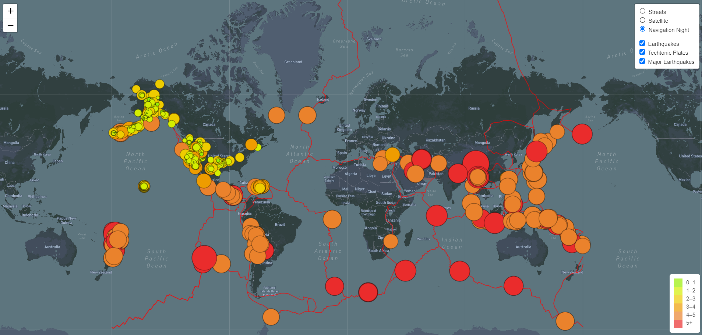

# Mapping_Earthquakes
Module 13

## Overview of the project:
The purpose of this project was to build a map using `Mapbox` and `Leaflet` with 3 layers then add tectonic plates and markers for each earthquake where the radius of the circle is dependent on magnitude.

## Results:
•	We first create map layers with `L.titleLayer` and the URL from the documentation making sure to link a configuration file containing the API key. We then create a map object with default settings for when the page is loaded. Next we create a variable for `baseMap` and each `overlay`, which are added to the map using the `L.control.layers(baseMaps, overlays).addTo(map);` function.

•	Once our map is ready, we retrieve each earthquake location and the tectonic plate lines using `d3.json().then(function(data())`, we define the style and create a `GeoJson` layer.

•	Our final interactive map looks like the following:

## Summary:
•	In summary, `Leaflet` is very useful to add data to a map in Javascript but because we need the API key to load and it’s not safe to upload the key, then we cannot render our webpage using GitHub .
